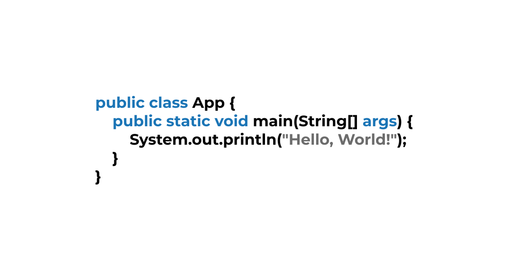

# Oi! Eu sou Wolney 👋🏻👨🏻‍💻

* "To do or do not. There is no try!"
* 3/9 Ciência da Computação - **_Universidade Tiradentes_**

Tecnologias 👇🏻

 
  
  
  
  
  
  
  
  

##

 
 

* Vamos conversar? 👉🏻 [Clique aqui](https://bio.link/wolneyol)

 
  
  

