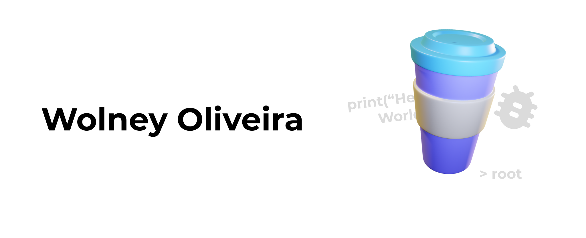

# Hello There! I am Wolney 👋🏻

* 4/9 Computer Science - [Universidade Tiradentes](https://www.unit.br/)

What I'm focusing on 👇🏻

 
  
  
  
  
  
  
  
  

##

 
 

* Lets talk? 👉🏻 [This way](https://bio.link/wolneyol)
