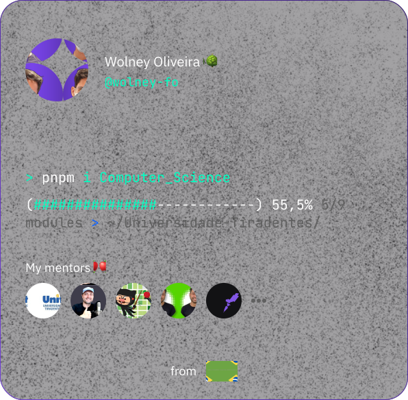

<h1 align="left">Hi, I'm Wolney Oliveira </h1>

- 🧐 Computer science student focusing on backend development and cybersecurity

- 🎓 A student at [Unit](https://www.instagram.com/unit_br/) (5/9)

- See more here 👉 [bio.link/wolneyol](https://bio.link/wolneyol)

- My focus for 2023:

 
  
  
  
  
  
  

   

─▄▀▀▀▀▀▀▀▀▀▀▀▀▀▀▀▀▀▀▄
█░░░█░░░░░░░░░░▄▄░██░█
█░▀▀█▀▀░▄▀░▄▀░░▀▀░▄▄░█
█░░░▀░░░▄▄▄▄▄░░██░▀▀░█
─▀▄▄▄▄▄▀─────▀▄▄▄▄▄▄▀

  

## Contact

