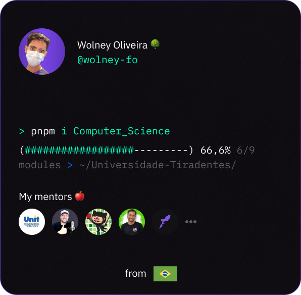

<h1 align="left">Hi, I'm Wolney Oliveira</h1>

- 🧐 Computer science student

- 🎓 Studying at [@Unit](https://www.instagram.com/unit_br/) (6/9)

- See more 👉 [bio.link/wolneyfo](https://bio.link/wolneyfo)

- My focus for 2023/2:

 
  
  
  
  
  
  

   

─▄▀▀▀▀▀▀▀▀▀▀▀▀▀▀▀▀▀▀▄
█░░░█░░░░░░░░░░▄▄░██░█
█░▀▀█▀▀░▄▀░▄▀░░▀▀░▄▄░█
█░░░▀░░░▄▄▄▄▄░░██░▀▀░█
─▀▄▄▄▄▄▀─────▀▄▄▄▄▄▄▀

  

## Contact

